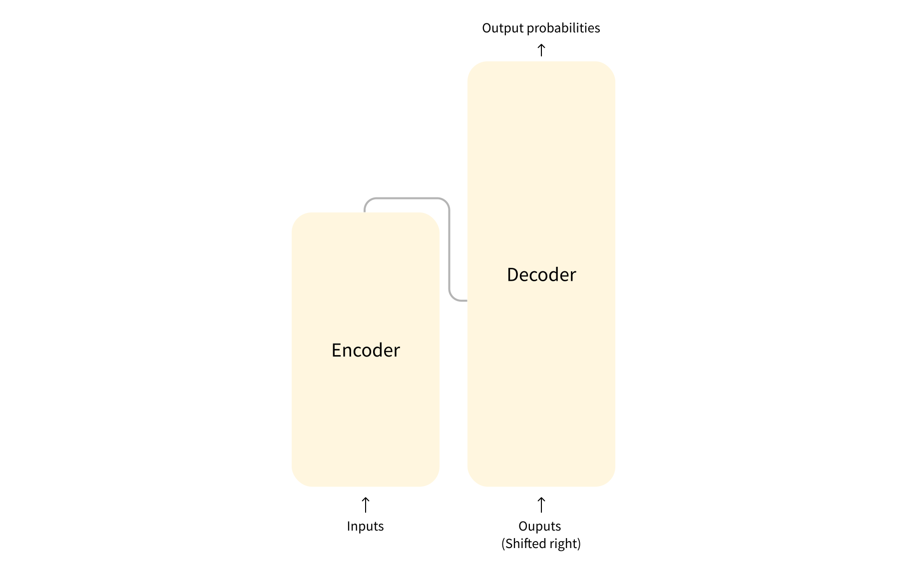

# Part 2: How Transformers Understand Text (The BERT Example - Simplified)

### Introduction: Reading Like a Transformer

Imagine understanding language like quickly scanning a whole page, instantly grasping connections between words, rather than reading word-by-word. That's the core idea behind **Transformers**, a powerful AI architecture. Older models struggled with speed and remembering context in long texts. Transformers overcome this using:

1.  **Parallel Processing:** Looking at many words at once.
2.  **Attention Mechanism:** Smartly focusing on relevant words to understand context, no matter how far apart they are.

We'll explore this using **BERT** as our main example. BERT is designed specifically for *understanding* text (it's an **Encoder-only** model). Let's see how it processes a sentence.

### The Journey of Text Through BERT

**Input:** "Cats sleep soundly."

**Step 1: Tokenization - Chopping Up Words**

Computers need numbers. **Tokenization** breaks text into smaller pieces (tokens), often "subwords," and gives each piece a number (ID).

*   **Why?** Handles new words ("soundly" might become `"sound"`, `"##ly"`) and keeps the vocabulary size reasonable. Special tokens like `[CLS]` (start) and `[SEP]` (end) are often added.

<details>
<summary>Click to see Demo: Tokenization</summary>

```python
# Make sure transformers is installed: !pip install transformers
from transformers import AutoTokenizer

tokenizer = AutoTokenizer.from_pretrained('bert-base-uncased')
text = "Cats sleep soundly."

# See the subword pieces
tokens = tokenizer.tokenize(text) 
print(f"Text: '{text}'")
print(f"Tokens: {tokens}") 

# Get the numerical IDs (adds [CLS] and [SEP])
token_ids = tokenizer.encode(text) 
print(f"Token IDs: {token_ids}") 

# Example Output:
# Text: 'Cats sleep soundly.'
# Tokens: ['cats', 'sleep', 'sound', '##ly', '.']
# Token IDs: [101, 7851, 4431, 3910, 1026, 1012, 102] 
```

*   **Explanation:** The code uses a standard BERT tokenizer to split the text into tokens (like `'cats'`, `'sleep'`, `'sound'`, `'##ly'`, `'.'`) and then converts them into unique ID numbers. This is the first step.
</details>

> [!TIP]  
> You can use [this tool](https://platform.openai.com/tokenizer) to understand how a piece of text might be tokenized by a language model


**Step 2: Embeddings - Giving Tokens Initial Meaning Vectors**

The Token IDs need meaning. An **Embedding** layer acts like a dictionary, mapping each ID to a list of numbers called a **vector**.

*   **Analogy:** Like giving each token starting coordinates on a "meaning map".
*   **Learned:** These vectors are learned during training.

<details>
<summary>Click to see Demo: Embedding Lookup (Conceptual)</summary>

```python
import numpy as np

# Example: Imagine a vocab of 100 tokens, each gets a vector of size 8
vocab_size = 100 
embedding_dim = 8 
# In reality, this table is learned; here we use random numbers for illustration
embedding_table = np.random.rand(vocab_size, embedding_dim) 

# Our token IDs from Step 1 (let's use some example IDs within 0-99)
sample_ids = [10, 25, 3, 99] # Example IDs as a standard Python list

# Look up the vectors for each ID
# We use list comprehension to get the corresponding row for each ID
initial_embeddings = [embedding_table[id_] for id_ in sample_ids]

print(f"Sample Token IDs: {sample_ids}")
# Convert to numpy array just to show the shape easily
initial_embeddings_np = np.array(initial_embeddings)
print(f"Shape of Initial Embeddings: {initial_embeddings_np.shape}") # (Num tokens, Embedding dimension)

# To view the first embedding vector (list of numbers):
# print("First embedding vector:\n", initial_embeddings[0]) 
```

*   **Explanation:** We created a conceptual lookup table (`embedding_table`). We took our list of Token IDs and looked up the corresponding vector (list of numbers) for each ID. These vectors hold the initial "meaning".
</details>


**Step 3: Positional Encoding - Adding Order Information**

Transformers look at words simultaneously, losing the original order. **Positional Encoding** adds information about *where* each token is in the sequence.

*   Another vector, representing the *position* (1st, 2nd, 3rd...) of each token, is created.
*   This position vector is **added** element-wise to the token's meaning vector (embedding).
*   **Result:** The final vector for each token now contains information about both *what* it means and *where* it is in the sequence.

<details>
<summary>Click to see Demo: Adding Positional Encoding (Conceptual)</summary>

```python
import numpy as np

# Use the embeddings from the previous step (convert back to numpy for easy math)
initial_embeddings_np = np.array(initial_embeddings) 
num_tokens = initial_embeddings_np.shape[0]
embedding_dim = initial_embeddings_np.shape[1]

# Create simple positional vectors (e.g., based on index)
position_vectors = np.zeros_like(initial_embeddings_np) # Initialize array of zeros
for i in range(num_tokens):
    # Example: Make vector slightly different for each position 
    # (real methods are more complex, e.g., sine/cosine)
    position_vectors[i, :] = np.sin(i / (10**(np.arange(0, embedding_dim, 2)/embedding_dim)))[:position_vectors.shape[1]//2]
    position_vectors[i, 1::2] = np.cos(i / (10**(np.arange(0, embedding_dim, 2)/embedding_dim)))[:position_vectors.shape[1]//2]
    # Or just use small random numbers for demo: position_vectors[i, :] = np.random.randn(embedding_dim) * 0.1

# Add positional vectors to token embeddings element-wise
position_aware_embeddings_np = initial_embeddings_np + position_vectors

print(f"Shape before adding position: {initial_embeddings_np.shape}")
print(f"Shape after adding position: {position_aware_embeddings_np.shape}")
# print("First Position-Aware Embedding Vector:\n", position_aware_embeddings_np[0]) # Uncomment to view
```

*   **Explanation:** We created unique vectors based on position and simply added them to the meaning vectors. Now, each vector entering the main Transformer layers knows both the token's meaning *and* its position.
</details>


**Step 4: Encoder Blocks - Processing with Attention**

These position-aware vectors now go through a stack of **Encoder Blocks** (e.g., 12 in BERT-base). The key process inside is **Self-Attention**.

*   **What is Self-Attention?** It lets each word look at all other words *in the same sentence* to figure out which ones are most relevant for understanding its own meaning *in this specific context*.
*   **How (The Q/K/V Intuition):**
    *   Each word creates a **Query** (Q - "Who is relevant to me?").
    *   Each word creates a **Key** (K - "Here's what context I offer.").
    *   Each word creates a **Value** (V - "Here's my actual meaning/content.").
    *   Queries are compared to Keys to find relevance (attention scores/weights).
    *   The final output for each word is a blend (weighted average) of all words' Values, based on those attention weights.
*   **Bidirectional:** Because words look both forwards and backwards, BERT gets a deep, bidirectional understanding.

<details>
<summary>Click to see Demo: The *Effect* of Attention (Simplified)</summary>

```python
import numpy as np

# Imagine we have 3 position-aware vectors (Values) for 3 words.
# Each row is a word's vector.
Values = np.array([
    [1.0, 0.0], # Vector representing Word 1's content
    [0.0, 1.0], # Vector representing Word 2's content
    [0.5, 0.5]  # Vector representing Word 3's content
])

# Now, imagine Word 2 ("sleep" in "Cats sleep soundly") calculated attention weights.
# It decided how much attention to pay to Word 1, Word 2, and Word 3.
# These weights MUST sum to 1.0
attention_weights_for_word2 = np.array([0.3, 0.6, 0.1]) # Example weights

# Calculate the attention output *for Word 2* by blending the Values
# Output = weight1*Value1 + weight2*Value2 + weight3*Value3
# Using numpy broadcasting: weights[:, np.newaxis] * Values -> sum along axis 0
attention_output_for_word2 = np.sum(attention_weights_for_word2[:, np.newaxis] * Values, axis=0)

print(f"Example Values (Word 1, Word 2, Word 3):\n{Values}")
print(f"\nExample Attention Weights calculated *by Word 2*:\n{attention_weights_for_word2}")
print(f"\nAttention Output *for Word 2* (Blended Context):\n{attention_output_for_word2}") 
# Example Output: [0.35 0.65] 
```

*   **Explanation:** This demo skips the complex Q/K matching. It shows the *result* of attention: how pre-calculated relevance weights (here, `[0.3, 0.6, 0.1]` for Word 2) are used to create a new, context-blended vector (`[0.35, 0.65]`) for Word 2 by taking a weighted average of all the word's Value vectors. The model does this for *every* word. After attention, a standard **Feed-Forward Network** processes each resulting vector individually.
</details>


**Step 5: Stacking Blocks**

The output from one Encoder Block becomes the input for the next. Repeating this (e.g., 12 times) allows BERT to build very deep, complex understanding.

### How BERT Learns: Pre-training (Fill-in-the-Blanks)

Where do the "right" attention weights or vector meanings come from? BERT learns them during **pre-training** on billions of sentences, mostly via **Masked Language Modeling (MLM)**.

*   **Concept:** It's like a massive "fill-in-the-blanks" game.
*   **Process:** The model sees sentences with random words hidden (`[MASK]`). It must predict the original word using the surrounding context (words before *and* after).

<details>
<summary>Click to see Demo: Creating Masked Input for MLM</summary>

```python
from transformers import AutoTokenizer

tokenizer = AutoTokenizer.from_pretrained('bert-base-uncased')
text = "The cat sat on the [MASK]." # We manually masked 'mat'

# Get the token IDs for this masked input
masked_token_ids = tokenizer.encode(text)

print(f"Original Text (with mask): {text}")
print(f"Token IDs for Masked Input: {masked_token_ids}")

# Find the ID for the word 'mat'
mat_token_id = tokenizer.convert_tokens_to_ids('mat')
print(f"(BERT's goal in training would be to predict ID {mat_token_id} for the mask)") 
```

*   **Explanation:** This shows what the input for the MLM task looks like. By trying to predict the masked word millions of times, the model learns grammar, context, and how words relate, tuning its attention mechanism and embedding meanings. (BERT also used Next Sentence Prediction, but MLM is the core idea).
</details>


### BERT's Output and Use

After passing through all Encoder blocks, BERT outputs final **contextualized embeddings** – one vector (list of numbers) for each input token. These vectors are rich with meaning derived from the full sentence context.

<details>
<summary>Click to see Demo: Getting Final Output Embeddings</summary>

```python
from transformers import AutoTokenizer, AutoModel # Use AutoModel for base embeddings
import torch # Still need torch slightly for model loading/inference with transformers

# Use a smaller BERT-like model for faster loading/running if possible
# Or use 'bert-base-uncased'
model_name = 'bert-base-uncased' 
# model_name = 'prajjwal1/bert-mini' # Uncomment to try smaller model if installed

try:
    tokenizer = AutoTokenizer.from_pretrained(model_name)
    model = AutoModel.from_pretrained(model_name)
    print(f"Loaded model: {model_name}")
except Exception as e:
    print(f"Error loading {model_name}, try installing or check name: {e}")
    model = None

if model:
    text = "Cats sleep soundly."
    # Prepare input for the model using the tokenizer
    inputs = tokenizer(text, return_tensors='pt') # 'pt' returns PyTorch tensors

    # Get the final outputs from the model
    # torch.no_grad() avoids tracking computations, making it faster
    with torch.no_grad(): 
        outputs = model(**inputs)

    # Extract the final hidden states (the contextual embeddings)
    last_hidden_states = outputs.last_hidden_state 

    # Convert the output tensor to a numpy array for easier viewing without PyTorch details
    final_embeddings_np = last_hidden_states.cpu().numpy()

    print(f"\nInput text: '{text}'")
    print(f"Shape of Final Output Embeddings: {final_embeddings_np.shape}") 
    # Shape: (batch_size=1, num_tokens_in_sequence, embedding_dimension)
    # e.g., (1, 6, 768) for bert-base
    # print("Final embedding vector for the first token ([CLS]):\n", final_embeddings_np[0, 0, :]) # Uncomment to view a vector
```

*   **Explanation:** We passed our tokenized text through the BERT model. The output contains the final, context-rich vector for each input token. These are much more informative than the initial embeddings.
</details>


These final embeddings are highly useful for tasks requiring text understanding:
*   **Classification:** Add a simple classifier on top (often using the `[CLS]` token's output vector).
*   **Feature Extraction:** Use these vectors as input for other ML models or for clustering.

### Summary: The Big Picture

BERT uses stacked **Encoder Blocks**, featuring **Self-Attention (Q/K/V)**, to read text bidirectionally and create deep contextual understanding. It learns this ability through **Pre-training** (like MLM). Its final output is rich **contextual embeddings**, great for analysis tasks.

This Encoder model is one key type of Transformer. Others, like Decoders (GPT) or Encoder-Decoders (T5), build on these core ideas for different tasks like text generation or translation.



*(See: [ General Transformer architecture](https://huggingface.co/learn/llm-course/chapter1/4#general-transformer-architecture))*

---

> [!NOTE]  
> For more details on specific components or other architectures,[ please refer to this reading](./part2-detailed.md).